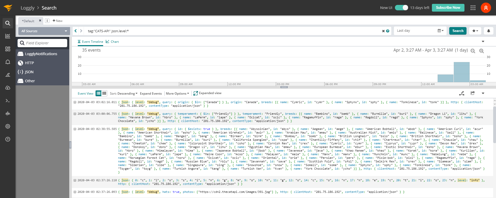

# probable-octo-broccoli

## Table of Contents
 - [Running the Project](Running)
 - [API Documentation](API)
 - [File Structure](Structure)
 - [Logs Examples](Logs)
 ## Running   
   1. Install Docker for Windows or Docker for Mac [DOCKER INSTALLATION GUIDE](https://docs.docker.com/install/)
    
   2. Open a command prompt at the root of the application's folder.
    
   3. Run `docker-compose build`
    
   4. Run `docker-compose up`
    
   5. Run `docker ps -aqf "name=ITAU_SERVER_APP"` and note the ID of the Node container
    
   6. Run `docker exec -it <nodeContainerID> sh` (replace <nodeContainerID> with the proper ID) to sh into the container
    
   7. Run `npm run generate-mongo` to seed the MongoDB database
    
   8. Type `exit` to leave the sh session
    
   9. Navigate to http://localhost:3000 to try the api or to localhost:6660/metrics to see the metrics execution for the api
   
  or
   2. Run `sh run.sh`
   
   3. Run `docker ps -aqf "name=ITAU_SERVER_APP"` and note the ID of the Node container
   
   4. Run `docker exec -it <nodeContainerID> sh` (replace <nodeContainerID> with the proper ID) to sh into the container
       
   5. Run `npm run generate-mongo` to seed the MongoDB database
       
   6. Type `exit` to leave the sh session
       
   7. Navigate to http://localhost:3000 to try the api or to localhost:6660/metrics to see the metrics execution for the api
   
 ## API
   [API DOCUMENTATION](https://documenter.getpostman.com/view/10126655/SzYaVy4T?version=latest)
   [](https://app.getpostman.com/run-collection/b5496213dbf511c47691)
   ### Get All Breeds
   #### Request
    
   `GET api/v1/cats/breed/`
    curl -i -H 'Accept: application/json' localhost:3000/api/v1/cats/breed
   #### Response
    
        HTTP/1.1 200 OK
        Date: Thu, 24 Feb 2011 12:36:30 GMT
        Status: 200 OK
        Connection: close
        Content-Type: application/json
        Content-Length: 2
        X-Response-Time: 143.004ms
        [
          {
                 "id": "abys",
                 "name": "Abyssinian"
           }
        ]
 ### Get a specific Breed
 
 #### Request
 `GET api/v1/cats/breed/{breed_name}`
 
     curl -i -H 'Accept: application/json' localhost:3000/api/v1/cats/breed/abys
 
 #### Response
 
     HTTP/1.1 200 OK
     Date: Thu, 24 Feb 2011 12:36:30 GMT
     Status: 200 OK
     Connection: close
     Content-Type: application/json
     Content-Length: 36
     X-Response-Time: 143.004ms
     {
         "temperament": [
             "Active",
             "Energetic",
             "Independent",
             "Intelligent",
             "Gentle"
         ],
         "photos": [
             "https://cdn2.thecatapi.com/images/3ut.jpg",
             "https://cdn2.thecatapi.com/images/4ra.gif",
             "https://cdn2.thecatapi.com/images/MTk5NDY0MQ.jpg"
         ],
         "_id": "5e86cb69660ef459caf0f932",
         "id": "abys",
         "__v": 0,
         "description": "The Abyssinian is easy to care for, and a joy to have in your home. They’re affectionate cats and love both people and other animals.",
         "name": "Abyssinian",
         "origin": "Egypt"
     }
 ### Get all breeds with a specific temperament
  
  #### Request
  `GET api/v1/cats/breed/temperament/{temperament_name}`
  
      curl -i -H 'Accept: application/json' localhost:3000/api/v1/cats/breed/temperament/Friendly
  
  #### Response
  
      HTTP/1.1 200 OK
      Date: Thu, 24 Feb 2011 12:36:30 GMT
      Status: 200 OK
      Connection: close
      Content-Type: application/json
      Content-Length: 36
      X-Response-Time: 143.004ms
      [
          {
              "id": "bamb",
              "name": "Bambino"
          },
          {
              "id": "buri",
              "name": "Burmilla"
          },
          {
              "id": "lihu",
              "name": "Dragon Li"
          },
          {
              "id": "hbro",
              "name": "Havana Brown"
          },
          {
              "id": "lape",
              "name": "LaPerm"
          },
          {
              "id": "ocic",
              "name": "Ocicat"
          },
          {
              "id": "raga",
              "name": "Ragamuffin"
          },
          {
              "id": "ragd",
              "name": "Ragdoll"
          },
          {
              "id": "sphy",
              "name": "Sphynx"
          }
       ]
  ### Get all breeds from a specific origin
    
    #### Request
    `GET api/v1/cats/breed/origin/{origin_name}`
    
        curl -i -H 'Accept: application/json' localhost:3000/api/v1/cats/breed/origin/Canada
    
    #### Response
    
        HTTP/1.1 200 OK
        Date: Thu, 24 Feb 2011 12:36:30 GMT
        Status: 200 OK
        Connection: close
        Content-Type: application/json
        Content-Length: 36
        X-Response-Time: 143.004ms
        [
            {
                "id": "cymr",
                "name": "Cymric"
            },
            {
                "id": "sphy",
                "name": "Sphynx"
            },
            {
                "id": "tonk",
                "name": "Tonkinese"
            }
        ]
 
 ## Structure
 ### CODE STRUCTURE
 ```
 probable-octo-broccoli
 ├── node_modules => folder with all node dependencies.
 ├── src => source code for the application.
 └──├── api => folder with classes that deal with all the api`s used. 
    ├── config => folder with all the configuration object used in all the project.
    ├── controller => folder that deals with all the logic of the endpoint.
    ├── enums => all the enums and constants.
    ├── model => classes that projects the object validation for the api.  
    ├── util => todos os utils da aplicacao.
    ├── routes => all the endpoint routes for the application
    ├── app.js => class that has all the configuration for the server
    ├── generateDatabase.js => class capabale for generating the seed for the mongo database
    ├── init.js => class responsible for initiate the node server
 ├── .dockerignore => file responsible for excluding files for the build of the container
 ├── .eslintrc.js => lint configuration file for node. 
 ├── .gitignore => file responsible for excluding certain files and folder for git
 ├── docker-compose.yml => file responsible for getting everything together.
 ├── Dockerfile => file responsible building the image of the server apllication
 ├── package.json => file responsible for all the packages and dependencies of the project.
 └── package-lock.json => file generated by npm (node package manager)
 ```
### Architecture
   
   Basically, we have a mongodb cluster running on port 27017, and our server is running on port 3000 and our exposed metrics for the api is running at port 6660, all that inside the container.
    We Then use the Docker Compose Network link to make both Mongo Cluster and Server to communicate to each other :
    ```YAML
    
        version: "3"
        services:
          server:
            container_name: ITAU_SERVER_APP
            restart: always
            build: .
            ports:
              - "3000:3000"
              - "666:666"
            links:   <==  LINKS BOTH MONGO AND SERVER TO THE SAME NETWORK
              - mongo
          mongo:
            container_name: MONGODB
            image: 'mongo'
            ports:
              - "27017:27017"
    ```
    
 ## Logs
   For the LOGS, i decided to go with [Loggy](https://www.loggly.com/), since loggly has a free plan usage and a well documented and highly active community of mainters of their libraries.
   HERE`S A EXAMPLES, SHOWING THE LOGS OF BOTH SERVER AND MONGO_CLUSTER IN REAL-TIME:
   
